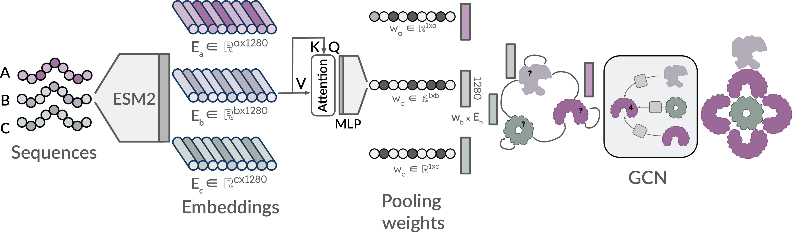

# Stoic

Fast and accurate protein stoichiometry prediction.


[](https://github.com/PickyBinders/stoic/blob/master/LICENSE.txt)
[](https://www.biorxiv.org/content/10.64898/2026.03.13.711535)
[](https://codecov.io/gh/PickyBinders/stoic)
[](https://colab.research.google.com/github/PickyBinders/stoic/blob/main/stoic_colab.ipynb)
[](https://huggingface.co/spaces/PickyBinders/stoic-space)
[](https://huggingface.co/PickyBinders/stoic)



Stoic predicts copy numbers for protein complex components directly from sequence, and can also export AF3-ready JSON based on the top predicted stoichiometries.

Web version (Hugging Face Space): [stoic-space](https://huggingface.co/spaces/PickyBinders/stoic-space)  
Pre-print: [Stoic: Fast and accurate protein stoichiometry prediction](https://www.biorxiv.org/content/10.64898/2026.03.13.711535v1.abstract?%3Fcollection=)

## Installation

### 1. Create and activate an environment

#### `venv`

```bash
python -m venv .stoic-venv
source .stoic-venv/bin/activate
```

#### `conda` / `mamba`

```bash
mamba create -n stoic-env python=3.10 -y
mamba activate stoic-env
```

### 2. Install Stoic (after env activation)

#### Install from local clone (editable)

```bash
git clone https://github.com/PickyBinders/stoic.git
cd stoic
python -m pip install --upgrade pip
python -m pip install -e .
```

#### Install directly from GitHub

```bash
python -m pip install git+https://github.com/PickyBinders/stoic.git
```

> **Note:** The first inference run requires internet connection to download model weights from Hugging Face. Next runs reuse cached files from `~/.cache/huggingface`, so offline usage works once the model is cached.

## Predict Stoichiometry from CLI

The `stoic_predict_stoichiometry` command supports:

1. a list of sequences,
2. a single FASTA file,
3. a directory of FASTA files (each FASTA treated as a separate complex).

```text
usage: stoic_predict_stoichiometry [-h]
                                   [--sequences SEQ [SEQ ...] | --input-path INPUT_PATH]
                                   [--model MODEL]
                                   [--top-n TOP_N]
                                   [--return-residue-weights]
                                   [--max-inference-seq-len MAX_INFERENCE_SEQ_LEN]
                                   [--output-dir OUTPUT_DIR]
                                   [--device DEVICE]

options:
  -h, --help            show this help message and exit
  --sequences SEQ [SEQ ...]
                        Protein sequences (one per unique chain)
  --input-path INPUT_PATH
                        Path to a FASTA file or a directory with FASTA files
  --model MODEL         HuggingFace model name or local path (default: PickyBinders/stoic)
  --top-n TOP_N         Number of top stoichiometry candidates (default: 3)
  --return-residue-weights
                        Return residue weights and save residue-level predictions
  --max-inference-seq-len MAX_INFERENCE_SEQ_LEN
                        Maximum sequence length for full-length inference
  --output-dir OUTPUT_DIR
                        Output directory for predictions and AF3 JSON files
  --device DEVICE       Device to use, e.g. cuda or cpu (default: auto-detect)
```

### Sequence list

```bash
stoic_predict_stoichiometry \
  --sequences "SENECA" "VIRTVS" \
  --top-n 3
```

### Single FASTA file

```bash
stoic_predict_stoichiometry \
  --input-path path/to/complex.fasta \
  --top-n 3
```

### Directory of FASTA files

```bash
stoic_predict_stoichiometry \
  --input-path path/to/fasta_dir \
  --top-n 3 \
  --output-dir stoic_predictions
```

In directory mode, outputs are saved per complex (`<fasta_stem>.json`, `<fasta_stem>_af3_input.json`, and optional residue predictions).

### Output files

When `--output-dir` is provided:

- single input (sequence list or single FASTA):
  - `results.json`
  - `af3_input.json`
  - `residue_predictions.pkl` (if `--return-residue-weights`)
- FASTA directory input:
  - `<complex_name>.json`
  - `<complex_name>_af3_input.json`
  - `<complex_name>_residue_predictions.pkl` (if `--return-residue-weights`)

## Use as a Python API

### High-level inference helper

```python
from stoic.predict_stoichiometry import predict_stoichiometry

results = predict_stoichiometry(
    sequences=["SENECA", "VIRTVS"],  # or FASTA path / FASTA dir path
    model_name="PickyBinders/stoic",
    top_n=3,
)
print(results)
```

### Load model directly from Hugging Face

```python
import torch
from stoic.model import Stoic


device = "cuda" if torch.cuda.is_available() else "cpu"
model = Stoic.from_pretrained("PickyBinders/stoic")
model.eval().to(device)
pred = model.predict_stoichiometry(["SENECA", "VIRTVS"], top_n=3)
print(pred)
```

## Citation

If you use Stoic, please cite:

```text
@article{litvinov2026stoic,
  title   = {Stoic: Fast and accurate protein stoichiometry prediction},
  author  = {Litvinov, Daniil and Pantolini, Lorenzo and {\v{S}}krinjar, Peter and Tauriello, Gerardo and McCafferty, Caitlyn L and Engel, Benjamin D and Schwede, Torsten and Durairaj, Janani},
  journal = {bioRxiv},
  year    = {2026},
  doi     = {10.64898/2026.03.13.711535},
  url     = {https://www.biorxiv.org/content/10.64898/2026.03.13.711535v1}
}
```

